<div align="center">

<picture>
  <source media="(prefers-color-scheme: dark)" srcset="docs/readme/hero-dark.svg">
  
</picture>

<br>

[](#quick-start) [](src) [](#it-reads-the-screen-not-just-the-code) [](#choose-your-model) [](#built-for)

**[The problem](#the-problem)** · **[How it works](#how-pawtrol-fixes-it)** · **[Features](#what-you-get)** · **[Quick start](#quick-start)** · **[Architecture](#architecture)** · **[Development](#development)**

</div>

<br>

Pawtrol is a Chrome extension with an AI agent inside. You tell it what to do on a web page, such as *"fill this form"*, *"find the cheapest monitor"* or *"book the earliest slot on Monday"*, and it clicks, types and scrolls for you.

The difference is what the AI model gets to see. **Before any page text or screenshot leaves your computer, Pawtrol finds your passwords, ID numbers, card numbers, names and faces, and hides them.** The model plans the task with placeholders like `<ID_1>`, and Pawtrol types the real value into the page itself, on your device.

<br>

## The problem

To use a website, an AI agent has to see it. The best models are too big to run on a laptop, so agents send what they see (screenshots and the page's text) to a cloud server.

<picture>
  <source media="(prefers-color-scheme: dark)" srcset="docs/readme/problem-dark.svg">
  
</picture>

That screenshot and text can carry things you never meant to share:

- **Passwords and one-time codes.** A password shows as dots on screen, but the page's code still holds the real text.
- **Government IDs** such as Aadhaar and PAN, and **bank details** such as card numbers.
- **Names, addresses, emails and phone numbers.**
- **Faces**, from profile photos, video calls and scanned ID cards.

Blurring a screenshot is not enough either. Much of this data is plain text that looks like any other text, some of it is drawn as pixels where page code can't see it, and nobody checks that the blur actually worked.

<br>

## How Pawtrol fixes it

The idea is simple: **the cloud model never needs the real values.** It only needs to know *there is* an Aadhaar number in field 4 so that it can say "type it into the search box". Pawtrol keeps the real value and fills it in locally.

<picture>
  <source media="(prefers-color-scheme: dark)" srcset="docs/readme/solution-dark.svg">
  
</picture>

| Step | What happens | Where |
|---|---|---|
| **1. Detect** | Finds sensitive values in the page, including text drawn as pixels | Your device |
| **2. Swap for tokens** | `2345 6789 0124` becomes `<ID_1>`, the face is blurred, passwords are withheld | Your device |
| **3. Plan in the cloud** | The model decides what to do, using only tokens: `type <ID_1> into Search` | Cloud (or local with Ollama) |
| **4. Fill in locally** | Pawtrol turns `<ID_1>` back into the real number and types it into the page | Your device |

The token vault lives in the extension's memory and is cleared after every task. A token the vault never issued is rejected, so a page can't trick the model into leaking a value.

<br>

## Six checks on every step

Detection can miss things, so Pawtrol stacks several independent checks, and it **fails closed**: if it can't prove a screenshot is clean, the screenshot is not sent.

<picture>
  <source media="(prefers-color-scheme: dark)" srcset="docs/readme/pipeline-dark.svg">
  
</picture>

| # | Layer | What it does |
|---|---|---|
| 01 | **Detect** | Reads the page structure, matches patterns, and validates checksums: **Verhoeff** for Aadhaar, **Luhn** for cards. A random 12-digit number is not mistaken for an Aadhaar. |
| 02 | **Tokenize** | Replaces each value with a stable placeholder (`<ID_1>`, `<CARD_1>`, `<PII_1>`). |
| 03 | **Redact** | Anything sensitive that can't be tokenized becomes `[REDACTED]`. |
| 04 | **Mask pixels** | On screenshots, masks ID numbers drawn as pixels and blurs faces. |
| 05 | **Verify** | Re-reads every mask with OCR and checks its pixels. Unreadable or uncertain areas are masked too. |
| 06 | **Send gate** | Only verified, tokenized data may leave. If anything failed, nothing is sent. |

Every step is written to a **privacy ledger**, a SHA-256 hash chain that stores counts and kinds only, never values. You can check that nobody edited it.

<br>

## It reads the screen, not just the code

Some sensitive data isn't in the page's code at all: an ID card photo, a `<canvas>`, a scanned PDF, or a frame from another site. Pawtrol runs small vision models **inside the browser** to find it.

<picture>
  <source media="(prefers-color-scheme: dark)" srcset="docs/readme/vision-dark.svg">
  
</picture>

| Model | Job | Size shipped |
|---|---|---|
| [PP-OCRv4](https://github.com/PaddlePaddle/PaddleOCR) text detector | Finds every block of text on the screenshot | **1.3 MB** (int8, from 4.7 MB) |
| [YuNet](https://github.com/opencv/opencv_zoo) face detector | Finds faces | **227 KB** |
| [Tesseract](https://github.com/tesseract-ocr/tesseract) | Reads the text inside the boxes that matter | bundled |

They run with [onnxruntime-web](https://onnxruntime.ai/) on **WebGPU**, falling back to WASM. OCR only runs inside images, canvases, video and frames, where the page code is blind, so ordinary text stays fast and readable.

<br>

## What you get

<table>
<tr>
<td width="50%" valign="top">

**An agent that finishes tasks**<br>
18 tools: read, click, type, select, scroll, navigate, switch tabs, pull text in bulk, and keep a plan and notes across long tasks. It can also **take a screenshot on demand** when the page code isn't enough.

</td>
<td width="50%" valign="top">

**Private by construction**<br>
The model works with tokens, never raw values. Screenshots leave only after on-device masking **and** verification.

</td>
</tr>
<tr>
<td valign="top">

**Start from any page**<br>
A floating paw button on every site starts a task on that tab, or press <kbd>Alt</kbd> + <kbd>Shift</kbd> + <kbd>P</kbd>. It shows each step, a Stop button and approval prompts, so the side panel is optional.

</td>
<td valign="top">

**Asks before anything risky**<br>
Paying, sending, deleting and submitting need your approval. Typing into password, CVV, OTP or ID fields is refused; you fill those in yourself.

</td>
</tr>
<tr>
<td valign="top">

**Resists prompt injection**<br>
Text on a page telling the AI what to do is treated as data and flagged to you. Tokens the vault never issued are rejected.

</td>
<td valign="top">

**Catches leaky websites**<br>
A tripwire watches the page's *own* network requests and alerts you when a site sends out a card number, Aadhaar, PAN or email, even when the agent isn't running.

</td>
</tr>
<tr>
<td valign="top">

**Learns on your device**<br>
It remembers false alarms, strategies that worked, and lessons from failed runs, per site. Nothing is uploaded.

</td>
<td valign="top">

**Works offline**<br>
With [Ollama](https://ollama.com), the model runs on your own machine and nothing leaves the device at all.

</td>
</tr>
</table>

<br>

## Start a task from any page

<picture>
  <source media="(prefers-color-scheme: dark)" srcset="docs/readme/launcher-dark.svg">
  
</picture>

The launcher sits in a closed shadow DOM, so the agent never reads it as page content, and it hides itself for the moment a screenshot is taken. You can hide it per site, or turn it off in the side panel's menu.

<br>

## Quick start

**You need:** Chrome 120 or later and Node.js 20 or later.

```bash
git clone https://github.com/b8matrix/pawtrol-pry.git
cd pawtrol-pry
npm install
npm run build
```

1. Open `chrome://extensions` and turn on **Developer mode**.
2. Click **Load unpacked** and choose the **`dist/`** folder (not the repository root).
3. Click the Pawtrol icon to open the side panel, then open **Settings** and pick a model provider.
4. Go to any website, type a task, and watch it work. Open **Menu → Privacy audit** to compare what was on screen with what the model received.

After changing code, run `npm run build` again and press reload on the extension card.

### Choose your model

Keys are yours and stay in `chrome.storage.local`. There is no Pawtrol server: requests go straight from your browser to the provider you pick.

| Provider | Runs where | Good for |
|---|---|---|
| **Ollama** | Your machine | Zero egress, fully offline |
| **Groq** | Cloud | Fast open models, free tier |
| **Cerebras** | Cloud | Very fast open models (`gpt-oss-120b`, Qwen) |
| **Google Gemini** | Cloud | Fast multimodal models |
| **Anthropic Claude** | Cloud | Strong multi-step planning |
| **OpenAI** | Cloud | GPT models |
| **NVIDIA NIM** | Cloud | Nemotron and other open models |
| **OpenRouter** | Cloud | One key for many models |

Whichever you choose, the provider only ever receives tokenized text and, when a screenshot is used, a verified redacted image. Claude, OpenAI and Gemini see that image directly; with the others, a vision model describes it in text.

<br>

## Architecture

<picture>
  <source media="(prefers-color-scheme: dark)" srcset="docs/readme/architecture-dark.svg">
  
</picture>

| Part | Source | Job |
|---|---|---|
| **Service worker** | `src/background/` | The agent loop, token vault, PII detection, safety policy, fail-closed send gate, ledger and on-device learning. Talks to the model provider. |
| **Content script** | `src/content/` | Builds a compact list of the page's elements, carries out clicks and typing, reports where sensitive fields and images are, and hosts the page launcher. |
| **Offscreen vision** | `src/offscreen/` | Runs the ONNX models on screenshots, masks and blurs, then verifies the result. |
| **Tripwire** | `src/tripwire/` | Runs in the page's own JavaScript world and watches `fetch`, XHR and `sendBeacon` for leaking PII. |
| **Side panel and settings** | `sidepanel.html`, `ui-shell.js`, `options.html` | The chat, the live step log, the privacy audit, and provider settings. |

<details>
<summary><b>What one step looks like</b></summary>

<br>

Task: *"Put my Aadhaar number into the search box"*, on a page showing `Aadhaar on file: 2345 6789 0124`.

1. **Snapshot.** The content script lists the page's interactive elements and text. Zero-width characters are stripped so hidden IDs can't slip past.
2. **Detect.** Pattern and checksum detectors find the Aadhaar (its Verhoeff digit is valid); context detectors find the name next to "Full name".
3. **Tokenize.** `2345 6789 0124` → `<ID_1>`, `Priya Sharma` → `<PII_1>`. The user's own task is tokenized too.
4. **Screenshot, if needed.** Masked, blurred and verified on the device, or not sent at all.
5. **Plan.** The model sees only tokens and replies `type(element_id=4, text="<ID_1>")`.
6. **Check.** The safety policy and the token check run: is this field allowed, and did the vault issue this token?
7. **Resolve and act.** `<ID_1>` becomes `2345 6789 0124` inside the extension, and the content script types it.
8. **Redact the result.** The tool result `Typed "2345 6789 0124"` goes back to the model as `Typed "<ID_1>"`.
9. **Finish.** Repeat until done, then clear the vault, write the ledger, and learn from the run.

</details>

<details>
<summary><b>What gets detected</b></summary>

<br>

| Category | Examples | How |
|---|---|---|
| Government IDs | Aadhaar, PAN, IFSC, passport | Patterns + **Verhoeff** checksum for Aadhaar |
| Financial | Card numbers, CVV and expiry fields, account numbers | Patterns + **Luhn** checksum + field labels |
| Credentials | Passwords, OTPs, PINs, secrets | Field type and label |
| API keys | Anthropic, OpenAI, GitHub, Slack, AWS, JWT, private keys | Known prefixes |
| Contact | Emails, Indian mobile numbers | Patterns + field context |
| Personal | Names, organisations, addresses | Label and value-shape rules |
| Faces | Profile photos, video, ID cards | YuNet, on device |
| Pixel text | IDs in images, canvases, frames, scans | PP-OCRv4 + OCR + checksums |

</details>

<br>

## Development

```bash
npm run build        # bundle src/ with esbuild into dist/
npm run watch        # rebuild on change
npm run check        # typecheck, unit tests, then build
npm run e2e          # real Chromium run with a mock model (needs port 11434 free)
npm run test:vision  # OCRs real redacted screenshots of the bench pages
npm run bench        # agent benchmark on local fixture sites
```

**How it's tested:**

- **Parity tests** fuzz the TypeScript port against the original minified build with thousands of random inputs.
- **The end-to-end test** loads the built extension into Chromium, runs real tasks on a page full of fake personal data, records every request the mock model receives, and fails if any raw value appears in one. It also covers the screenshot tool, the page launcher on a site that swallows clicks, and starting from a blank tab.
- **The vision test** OCRs the redacted screenshots of adversarial pages in [`bench/pages`](bench/pages) against ground-truth files: IDs in a canvas and a PNG, zero-width tricks, a card inside an iframe, misleading password labels, and prompt injection.
- **The agent benchmark** in [`bench/agent`](bench/agent) grades 12 held-out tasks across webmail, shopping, booking, a wiki and ticketing, on the final answer or on the state the agent left behind.

<details>
<summary><b>Repository map</b></summary>

```
src/
  background/   service worker: agent loop, privacy pipeline, providers, learning
  content/      page snapshot, actions, sensitive regions, page launcher
  offscreen/    ONNX vision: PP-OCRv4, YuNet, fusion, masking, verification
  tripwire/     watches the page's own network calls
  shared/       types, checksums, text normalisation
models/         ONNX models (int8 text detector, face detector)
bench/          adversarial pages with truth files, agent benchmark
tests/          unit, parity, vision and end-to-end tests
docs/           project overview, build plan, README artwork
scripts/        build, model preparation, README artwork generator
```

The README animations are generated by [`scripts/readme-art.mjs`](scripts/readme-art.mjs) (`node scripts/readme-art.mjs`) in light and dark versions.

</details>

<br>

## Status and roadmap

**Working today:** the agent, the on-device privacy pipeline and vision models, the token vault, the fail-closed send gate, the tripwire, the ledger, the page launcher, eight model providers, and the test suites above.

**Next:**

- A small **privacy gateway server** that re-scans everything with a second, independent PII detector before it reaches the cloud, and returns a signed "zero PII" receipt.
- **Faster vision** on real GPUs, re-checking only the parts of the screen that changed.
- **Token-to-site binding**, so a value can only be typed on the site it came from.
- An on-device model for names and addresses in free text.

The full write-up (research, design decisions, measurements, bugs found and fixed) is in [`docs/PAWTROL_PROJECT_OVERVIEW.md`](docs/PAWTROL_PROJECT_OVERVIEW.md).

<br>

## Built for

**Smart India Hackathon 2026, Problem Statement 26171** (ISRO / Department of Space): *On-Device Visual Perception for Light-Weight Browser Agents*: a browser agent with a real local vision model and a privacy filter that hides sensitive information before anything leaves the device.

<br>

## Acknowledgements

[PaddleOCR](https://github.com/PaddlePaddle/PaddleOCR) (PP-OCRv4, Apache-2.0) · [OpenCV Zoo](https://github.com/opencv/opencv_zoo) (YuNet, MIT) · [Tesseract](https://github.com/tesseract-ocr/tesseract) and [tesseract.js](https://github.com/naptha/tesseract.js) (Apache-2.0) · [ONNX Runtime Web](https://onnxruntime.ai/) (MIT)

<div align="center">
<br>
<sub>Pawtrol: it fetches things for you and guards what's yours.</sub>
</div>
